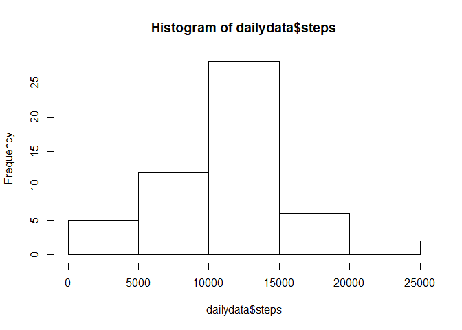
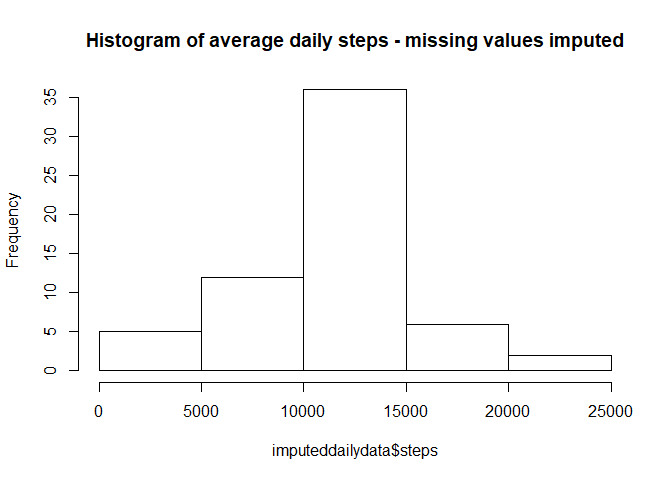
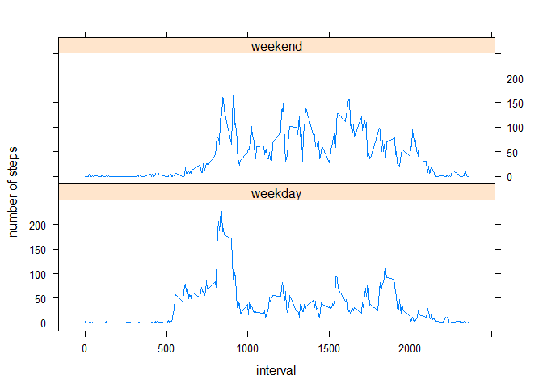

# Reproducible Research: Peer Assessment 1
Luc van Schijndel  
## Introduction
This file aims to complete Course Project 1 of the Reproducible Research course
by John Hopkins University on Coursera.

## Loading and preprocessing the data
The first task is to load and preprocess the data. It is assumed the data source
is located in the working folder - it is included in the GitHub repository
that this file is located in. The data field is read in as a character vector
and coerced into a Date class


```r
unzip("./activity.zip",exdir=".")
data <- read.table(file = "activity.csv", header = TRUE, sep = ",", colClasses = c("numeric", "character", "numeric"))
data$date <- as.Date(data$date, "%Y-%m-%d")
```

## What is mean total number of steps taken per day?

In order to answer this question, we first have to calculate the sum of steps
for each day, for which we use the 'aggregate' function. As specified in the
assignment, na values can be ignored, hence the na.rm argument is set to TRUE.


```r
dailydata <- aggregate(steps ~ date, data = data, FUN = sum, na.rm = TRUE)
hist(dailydata$steps)
```

<!-- -->

```r
dailystepsmean <- mean(dailydata$steps)
dailystepsmean
```

```
## [1] 10766.19
```

```r
dailystepsmedian <- median(dailydata$steps)
dailystepsmedian
```

```
## [1] 10765
```

The mean of the total number of steps taken per day is 1.0766189\times 10^{4} and
the median is 1.0765\times 10^{4}.

## What is the average daily activity pattern?

To establish the average daily activity pattern, we first have to average the 
amount of steps for each interval, which we do with the aggregate function but
now using 'mean' as the function.
Subsequently, we make a time series plot of the average steps per interval.


```r
intervaldata <- aggregate(steps ~ interval, data = data, FUN = mean, na.rm = TRUE)
with(intervaldata, plot(steps~interval, type = "l"))
```

<!-- -->

```r
maxdailysteps <- max(intervaldata$steps)
dailymaxinterval <- intervaldata$interval[intervaldata$steps == maxdailysteps]
```

On average across all the days in the dataset, interval 835
has the maximum average number of steps, namely 206.1698113.

## Imputing missing values

To assess the impact of imputed values, we first calculate the total number of
missing values in the dataset  


```r
NAcount <- sum(is.na(data$steps))
NAfrac <- sum(is.na(data$steps))/length(data$steps)
```

So the total number of missing values is 2304, which is 0.1311475 of
the total data. Before we come up with a strategy on how to impute these values,
let's first inspect where the missing data is.


```r
naintervals <- data[is.na(data$steps),]
countnaperday <- aggregate(interval ~ date, naintervals, FUN = length)
countnaperday
```

```
##         date interval
## 1 2012-10-01      288
## 2 2012-10-08      288
## 3 2012-11-01      288
## 4 2012-11-04      288
## 5 2012-11-09      288
## 6 2012-11-10      288
## 7 2012-11-14      288
## 8 2012-11-30      288
```

The amount of missing data per day is always equal to 288. Thus, whenever data
is missing, all data for that day is missing. That means that imputed data
cannot reference the data for that day - there is no data for that day.
Therefore, we choose to replace the missing step count for an interval with the
average step count for that interval.


```r
imputeddata <- data
for(i in 1:nrow(imputeddata)) {
        if(is.na(imputeddata$steps[i])) {
                imputeddata$steps[i] = intervaldata$steps[intervaldata$interval == imputeddata$interval[i]]
                }
}

imputeddailydata <- aggregate(steps ~ date, data = imputeddata, FUN = sum, na.rm = TRUE)
hist(imputeddailydata$steps, main = "Histogram of average daily steps - missing values imputed")
```

<!-- -->

```r
imputeddailystepsmean <- mean(imputeddailydata$steps)
imputeddailystepsmedian <- median(imputeddailydata$steps)
```

After imputing, the mean of the daily steps is `imputeddailystepsmean`. This is
the same as before imputing, which is to be expected given that whenever data
is missing, all data for that day is missing. The median after imputing is
1.0766189\times 10^{4}, which is a minimal change from the
1.0765\times 10^{4} before imputing.

Thus, imputing missing data has no impact on the estimates of the total daily number of steps.

## Are there differences in activity patterns between weekdays and weekends?

To establish whether there are differences in activity patterns between
weekdays and weekends, we first add a column to the dataset that indicates
whether a day is a weekday or a weekend day.


```r
data$weekday[weekdays(data$date) == "Saturday" | weekdays(data$date) == "Sunday"] <- "weekend"
data$weekday[weekdays(data$date) == "Monday" | weekdays(data$date) == "Tuesday"|
        weekdays(data$date) == "Wednesday" | weekdays(data$date) == "Thursday" |
        weekdays(data$date) == "Friday" ] <- "weekday"
```

The next step is to calculate the average amount of steps for each interval for weekdays and weekend days.


```r
weekdaydata <- aggregate(steps ~ interval + weekday, data = data, FUN = mean, na.rm = TRUE)
```

Last but not least, we make a panel plot containing a time series plot of the 5-minute interval and the average number of steps taken, averaged across all weekday days or weekend days.


```r
library(lattice)
xyplot(steps ~ interval | weekday, data = weekdaydata, type = "l", layout = c(1,2), ylab = "number of steps")
```

<!-- -->

From the plot, it appears there are indeed differences in activity patterns between weekdays and weekends.

